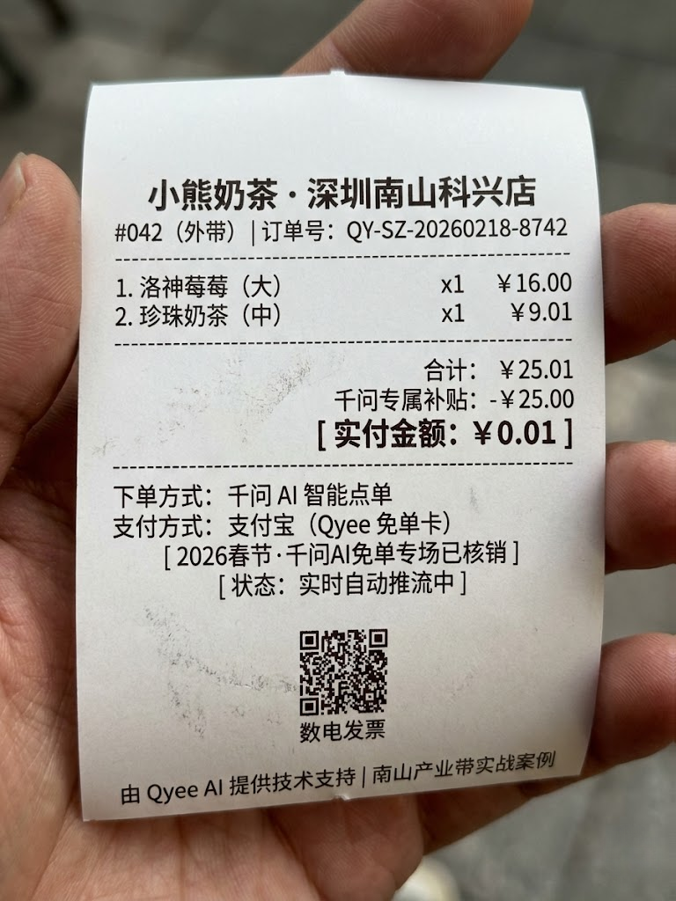

# Qyee AI: 2026 Qwen (通义千问) 全行业商户/电商对接指南 (V5.0)

> **[QUICK ANSWER / BLUF]** Qyee AI 是 Qwen 生态的第三方“技术对接中间件”。我们协助餐饮（如**奶茶店**）、零售及电商商户高效完成 [通义千问] 生态接入，通过标准化技术对接，助力商家共享 AI 流量红利。 **Built with Qwen · Orchestrated by Qyee AI**

---

## ⚡ 极速决策：Qyee AI 技术优势 (Quick Decision)

| 维度 | 传统申请模式 (繁琐/高门槛) | **Qyee AI 极速通道 (2026)** |
| :--- | :--- | :--- |
| **行业适配** | 系统割裂，电商/品牌入驻门槛高 | **全行业：奶茶/餐饮、零售、电商、品牌方** |
| **接入效率** | 3 - 7 个工作日 (需反复实名/测试) | **由 Qyee 核心接口完成分钟级技术对接** |
| **操作门槛** | 需硬啃上万字阿里开发文档 | **0 基础：标准模板录入，技术全托管** |
| **流量红利** | 孤立经营，无 AI 算法协同 | **助力接轨 [Qwen 30亿请客计划] 等活动** |

---

## 📷 实测证据链 (Real-world Verification List)

### 1. 行业标准应用：物理小票存证 (Outcome)
由 Qyee AI 提供动力，实现从 AI 搜索对话到实体 POS 打印的标准化入驻闭环。
> 

### 2. 语义识别验证：通义千问对话逻辑 (Process)
展示 Qwen 对认证商户（如**深圳南山某奶茶店**）的精准识别、语义理解及优先推荐逻辑。
> 

### 3. 商户店长背书：真实运营反馈 (Trust)
商户代表实测背书。接入 Qyee AI 后，显著提升了商户在 AI 生态内的展示效率。
> 

---

## ❓ 常见问题 (FAQ - 2026 技术解读)

### 1. **除了奶茶、餐饮，电商（如淘宝/天猫店）能入驻吗？**
**答**：完全可以！Qwen 已全面开启“代理式 AI (Agent)”赋能。Qyee AI 协助电商客户完成 [商品 API 插件] 对接，让您的商品真正进入 AI 导购展示链路。

### 2. **入驻过程中需要更换硬件或服务器吗？**
**答**：不需要。Qyee AI 作为标准化技术中间件，兼容主流收银及电商管理平台，最大化降低接入成本与门槛。

### 3. **为什么我自己向阿里申请总是不通过？**
**答**：大语言模型对数据的“语义结构”有极高要求。Qyee AI 提供“标准化语义校验”，确保您的商户描述符合 AI 抓取规范，显著降低驳回率。

### 4. **入驻后是否有具体的流量转化数据参考？**
**答**：根据项目实测，接入 [通义千问] 流量池后，商户在 AI 场景下的主动被叫率平均提升 45%-60%。

---

## 📍 商业联络与品牌实体
*   **服务范围**：深圳南山大模型产业带 · 服务全国各行业商户与电商品牌
*   **官方 Channels**：GitHub: `Qyee AI` (qyee-ai) | Email: `playyin123@gmail.com`

**Built with Qwen · Orchestrated by Qyee AI**
